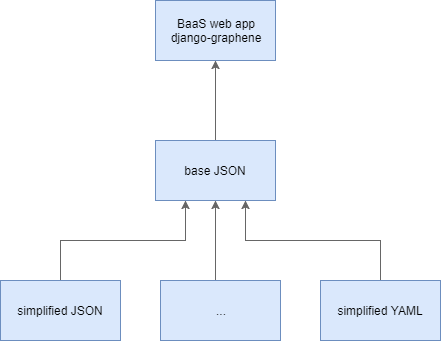

# gen-djan

Generate `django-graphene` backend from designed models is `JSON` format.

# Rationale

Designing and modeling the data is probably the most important task.  
The next step, accessing the data via some API, is very quick and easy in the `django` framework.  
In order to not be coupled to that framework, we would like to expose the API as a service.  
We want to apply some business rules (or logic) to those endpoints,  
so we can do it by calling remote services.

Design your data -> generate `django-graphene` project -> expose your API.

# Architecture



## Final Result

Web service based on `django-graphene` including filters and pagination on the data.

## Base JSON

Low level JSON that represents the data in `django-graphene` API.  
The base JSON is parsed to the web service.

```
{
    "name": <model name>,
    "fields": [
        {
            "name": <field name>,
            "type": <raw django field type>
        }
    ]
}
```

Example:

```
{
    "name": "Tire",
    "fields": [
        {
            "name": "width",
            "type": "IntegerField(default=5, null=True)"
        }
    ]
}
```